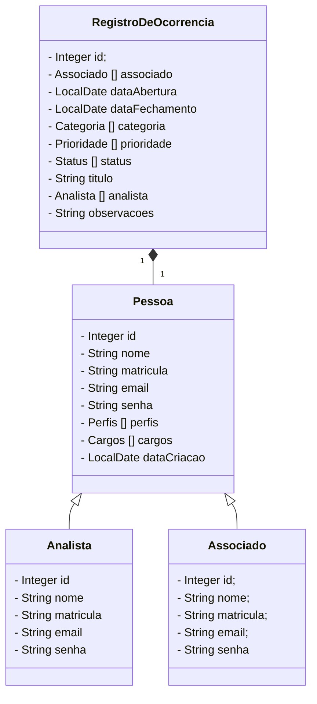

# HelpDesk Corporativo - Abertura de Ocorrências / Tickets
Back-End em Java contendo a parte lógica tais como regras de negócio, API, requisições.

## Diagrama de Classes (Domínio da API)

```mermaid
classDiagram
  class RegistroDeOcorrencia {
    - Integer id;
    - Associado [] associado
    - LocalDate dataAbertura
    - LocalDate dataFechamento
    - Categoria [] categoria
    - Prioridade [] prioridade
    - Status [] status
    - String titulo
    - Analista [] analista
    - String observacoes

  }

  class Pessoa {
    - Integer id
    - String nome
    - String matricula
    - String email
    - String senha
    - Perfis [] perfis
    - Cargos [] cargos
    - LocalDate dataCriacao

  }

  class Analista {
    - Integer id
    - String nome
    - String matricula
    - String email
    - String senha

  }

  class Associado {
    - Integer id;
    - String nome;
    - String matricula;
    - String email;
    - String senha

  }

  RegistroDeOcorrencia "1" *-- "1" Pessoa


    Pessoa <|-- Analista
    Pessoa <|-- Associado
  
```
    
